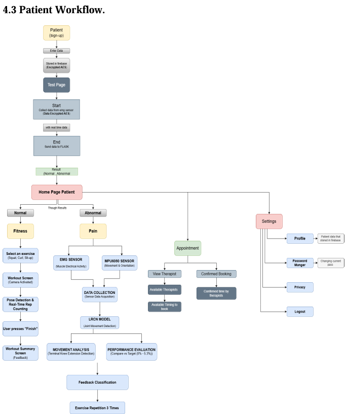
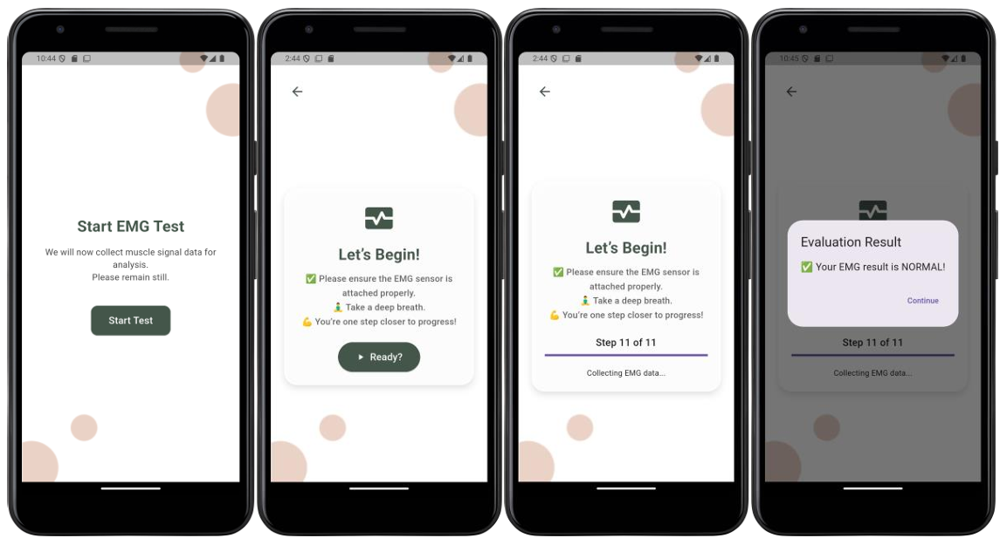
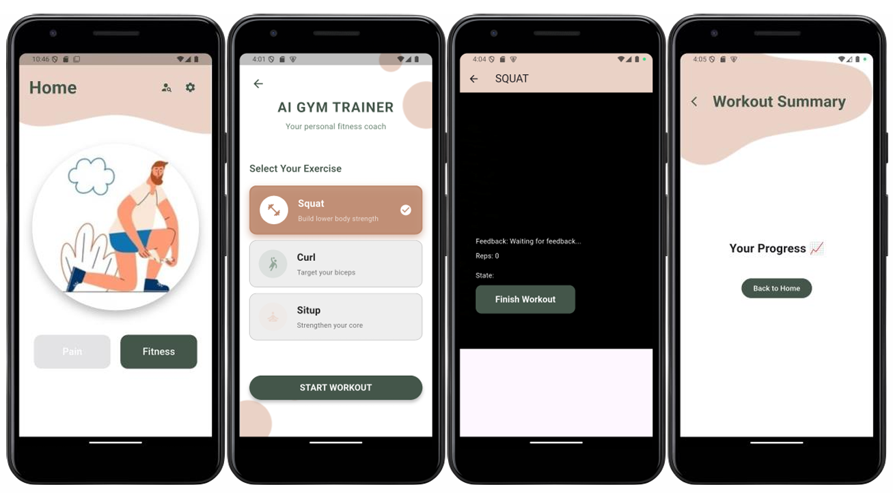

# 💪 Smart Rehabilitation System (RehabSecure)

An intelligent and secure IoT-based remote physiotherapy platform that combines wearable sensors, AI-based analysis, and a mobile app to monitor and enhance patient rehabilitation, especially targeting knee dysfunction and recovery.

---

## 🧠 Overview

The **Smart Rehabilitation System** is a mobile-enabled rehabilitation assistant for physiotherapy patients. It classifies neuromuscular activity as *normal* or *abnormal* using **EMG signals** and provides real-time corrective feedback via **IMU**, **camera tracking**, and **ECG-based fatigue monitoring**.

It is built to:
- Improve exercise correctness
- Enable remote therapist supervision
- Monitor fatigue & heart condition
- Secure patient health data

---

## 👩‍⚕️ Key Features

- **sEMG-Based Diagnosis**: Real-time classification of muscle activity using EMG data.
- **AI Gym Trainer**: Camera + sensor-based exercise correction (Squats, Sit-ups, Bicep Curls).
- **Joint Angle Estimation**: IMU sensors estimate knee motion and quality.
- **Fatigue Detection**: ECG sensor monitors cardiac fatigue using ML.
- **Realtime Feedback System**: Movement phase tracking, ROM analysis, and pace feedback.
- **Secure Patient Data**: AES encryption and blockchain-backed logging.
- **Mobile App (Flutter)**: For both patients and therapists with Firebase integration.

---

## 📲 Mobile App Features

- 👤 Patient & Therapist Login (Role-based UI)
- 📈 EMG Signal Classification & Initial Diagnosis
- 🤸 Exercise Guidance with Live Correction
- 🧑‍⚕️ Therapist Dashboard to Track Sessions & Availability
- 📅 Remote Appointment Booking
- 🔐 Encrypted session logs & secure Firebase backend

---

## 🧪 Technologies Used

| Component          | Technology Used                             |
|-------------------|---------------------------------------------|
| **Frontend**       | Flutter (Dart)                              |
| **Backend**        | Flask (Python) + ML/Deep Learning Models    |
| **Realtime DB**    | Firebase Firestore & Realtime DB            |
| **Authentication** | Firebase Authentication                     |
| **Hardware**       | ESP32, MyoWare EMG, MPU6050 IMU, AD8232 ECG |
| **Security**       | AES Encryption + Blockchain (Session Logs)  |
| **ML Models**      | Gradient Boosting (EMG), Random Forest (ECG), LRCN (Angle Estimation) |
| **Camera Tracking**| MediaPipe (CV-based pose analysis)         |

---

## 🧪 AI & ML Models

### 🔹 EMG Classification (Normal/Abnormal)
- Features: MAV, RMS, ZC, SSC, Skewness, Kurtosis...
- Final Model: **Gradient Boosting**
- Accuracy: **~79.3%**
- Preprocessing: Wavelet Denoising, Windowing (256ms), Normalization, SMOTE

### 🔹 Joint Angle Estimation + Motion Classification
- Model: **LRCN (CNN + BiLSTM)** hybrid
- Input: EMG + Knee Angle (IMU)
- Outputs: Joint Angle (regression), Movement Pattern (classification)
- MAE: **33.5°**, F1-Score: **73%** (Abnormal)

### 🔹 ECG-Based Fatigue Detection
- Signal: AD8232 ECG (R-peak detection, beat segmentation)
- Model: **Random Forest**
- Accuracy: **88.2%**, F1-Score: **0.89**

---

## 🧬 System Architecture

### 🖼️ Visual Diagram

---

📷 App Screenshots

🛡️ Security Highlights
AES Encryption (128-bit): Fast, real-time symmetric encryption of sensitive EMG/ECG data.

Blockchain Logging: Immutable session records with timestamps.

Role-Based Access: Separate flows for therapists and patients.

Firebase Authentication: Secure sign-up/login with email/password validation.

🚀 Future Enhancements
📡 Cloud-based therapist video supervision

💾 Real-time training dashboard & feedback history

🗣️ Voice-guided exercise assistant

📊 Cross-patient analytics for large-scale rehab studies

🧠 Integration with GPT-based health assistants

👩‍💻 Authors
Asmaa Ahmed Ahmed - AI
Farah Nasr Gowiyd - AI
Habiba Osama Abd Elkhalek - AI
Mariam Ahmed Mahmoud - Cyber Security
Marian Maher Sobhy  - Computer Science

Supervised by:
Prof. Dr. Saad Darwish
Dr. Sahar Ghanem
Eng. Esraa Hamshary

🏫 Developed at
Faculty of Computer Science & Artificial Intelligence
Pharos University in Alexandria
Class of 2025 🎓

📚 References
UCI Machine Learning Repository – EMG datasets
EPFL ECG Fatigue Dataset
MediaPipe Pose Estimation Toolkit

Full model references and citations available in /documentation.pdf
